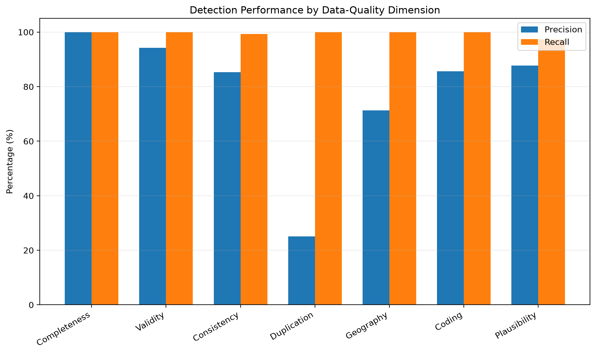
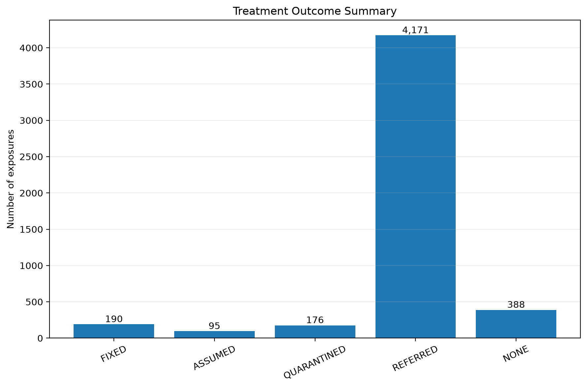
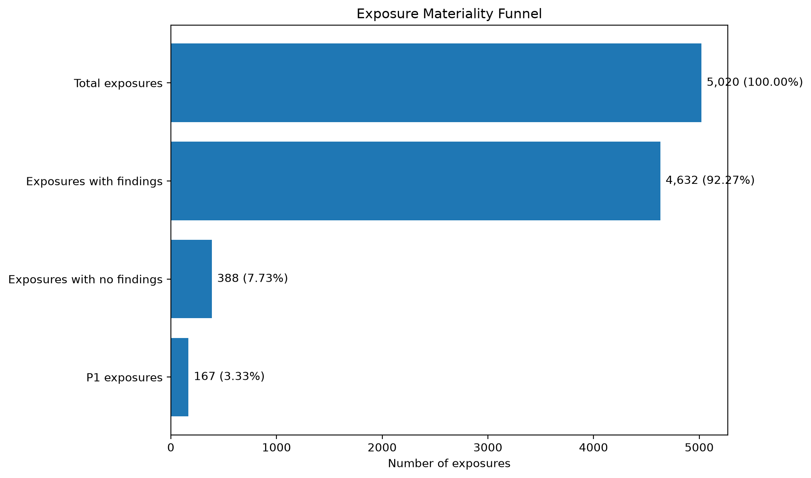
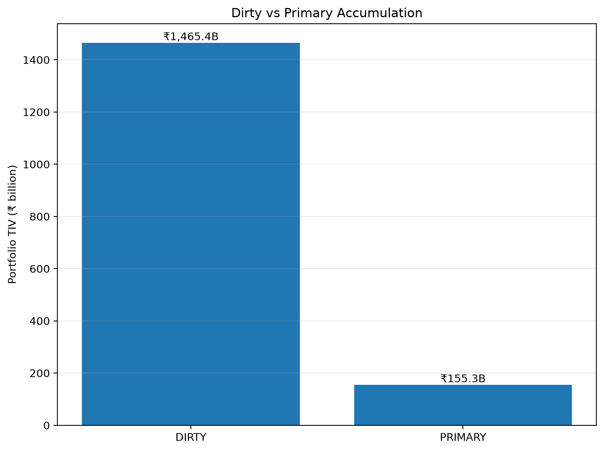
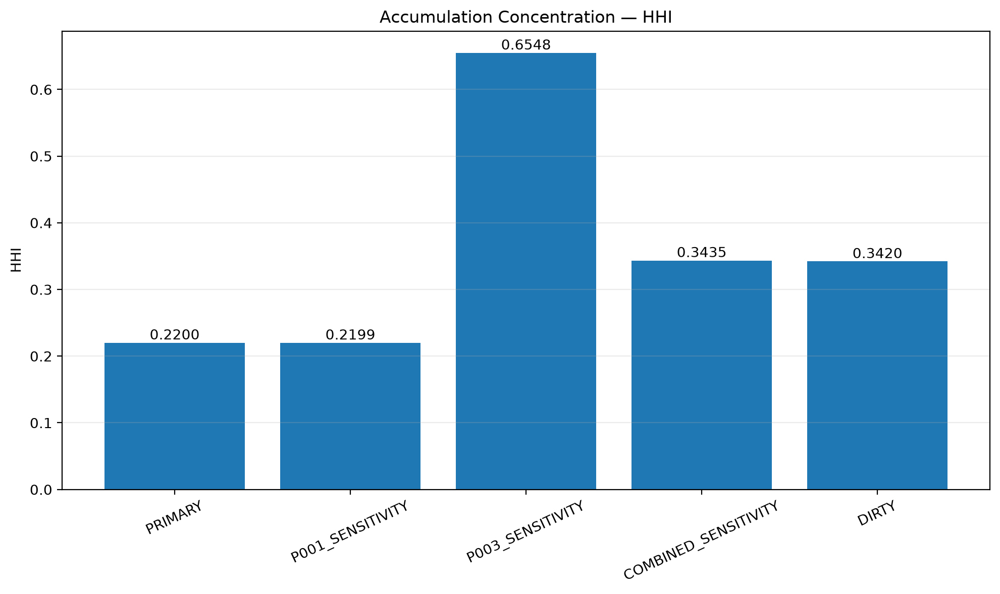
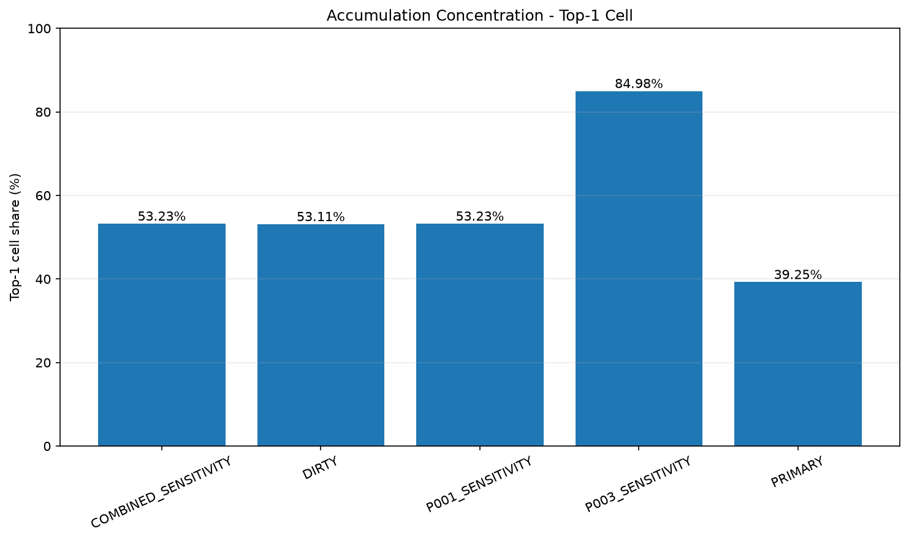
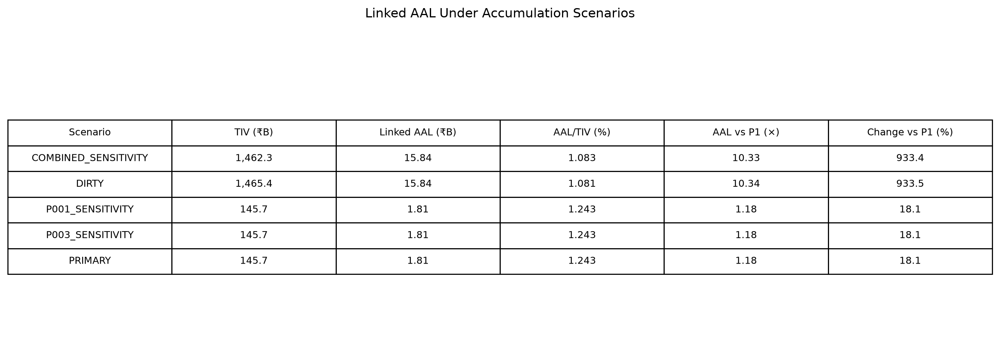

# Exposure Data Quality & Accumulation Analysis — Coastal Odisha

An end-to-end exposure data-quality workflow for a synthetic coastal Odisha portfolio, covering portfolio validation, controlled error injection, detection, materiality triage, treatment, accumulation analysis, and linkage to catastrophe-risk outputs.

**Stack:** Python 3.11 · PostgreSQL 16 · PostGIS 3.4 · pandas · NumPy · GeoPandas · Shapely · pyproj · SQLAlchemy · Matplotlib · openpyxl

---

# Headline finding

Exposure data quality can materially alter the **portfolio exposure base and spatial accumulation profile** used by catastrophe-risk workflows.

In the validated current implementation:

- The clean synthetic portfolio contains **5,000 records** with total TIV of approximately **₹168.867B**.
- Controlled injection produces a **5,020-record dirty portfolio**.
- The ground-truth catalogue contains **10,001 error events** across 39 error types.
- The detector produces **11,035 quality flags** affecting **4,632 records**.
- Overall detection performance is **90.46% precision** and **99.81% recall** when completeness is included.
- Excluding deterministic completeness rules, injected-error performance is **75.28% precision** and **99.41% recall**.
- Treatment produces **5,020 cleansed records** with 190 fixed, 176 quarantined, 95 assumed, 4,171 referred and 388 requiring no treatment.
- The dirty accumulation contains **₹1.465T** of TIV across 18 occupied grid cells.
- The primary accumulation-eligible portfolio contains **₹145.684B** across 17 occupied grid cells.
- The dirty-to-primary TIV ratio is approximately **10.06×**.

The dirty-to-primary difference is a **scenario comparison under the project's treatment and accumulation-eligibility framework**. It should not be interpreted as a claim that data cleaning has proven that the underlying real portfolio was overstated by that amount.

---

# Results at a glance

| Metric | Current validated result | Notes |
|---|---:|---|
| Clean portfolio | **5,000 records** | Synthetic exposure portfolio |
| Dirty portfolio | **5,020 records** | 5,000 clean records + 20 duplicate rows |
| Ground-truth events | **10,001** | Multiple events can affect one record |
| Unique GT row IDs | **4,611** | 409 portfolio rows have no injected error |
| Detection flags | **11,035** | Across 39 rules |
| Records with ≥1 detected finding | **4,632** | Current detector output |
| Clean total TIV | **₹168.867B** | 5,000-record clean portfolio |
| Dirty accumulation TIV | **₹1.465T** | Contaminated scenario |
| Primary accumulation TIV | **₹145.684B** | Accumulation-eligible scenario |
| Dirty occupied cells | **18** | Project 1 0.25° grid |
| Primary occupied cells | **17** | Project 1 0.25° grid |
| Overall TP | **9,982** | All ground-truth dimensions |
| Overall FP | **1,053** | Includes interaction-driven flags |
| Overall FN | **19** | Ground-truth pairs not detected |
| Overall precision | **90.4576%** | Including completeness |
| Overall recall | **99.8100%** | Including completeness |
| Injected-only TP | **3,207** | Completeness excluded |
| Injected-only FP | **1,053** | Completeness excluded |
| Injected-only FN | **19** | Completeness excluded |
| Injected-only precision | **75.2817%** | Completeness excluded |
| Injected-only recall | **99.4110%** | Completeness excluded |

---

# Why this project

Exposure data quality is often treated as a preprocessing problem.

In catastrophe modelling, it is also a **risk-modelling problem**.

A portfolio can pass basic database validation while still containing errors or ambiguities that materially change:

- exposure totals
- geographical accumulation
- concentration metrics
- portfolio ranking
- modelled loss
- downstream risk decisions

The workflow therefore follows an exposure-analyst process:

1. Receive a portfolio.
2. Interrogate the data.
3. Identify quality issues.
4. Distinguish confirmed errors from uncertainty and assumptions.
5. Assess materiality.
6. Treat or escalate the records.
7. Recalculate accumulation.
8. Quantify the effect on the exposure/risk scenario.
9. Preserve an auditable trail of what changed and why.

> **Not every data-quality issue is equally important, and not every populated value is necessarily correct.**

---

# Data-quality framework

The portfolio is evaluated across seven operational data-quality dimensions:

| Dimension | Focus |
|---|---|
| Completeness | Missing or incomplete required fields |
| Validity | Values violating explicit field constraints |
| Consistency | Conflicting values across related fields |
| Duplication | Duplicate or near-duplicate exposure records |
| Plausibility | Values that are possible but suspicious |
| Geography | Coordinate, district, postcode and spatial consistency |
| Coding | Invalid or inconsistent categorical codes |

Documentation and auditability are treated as a cross-cutting requirement.

Each finding is classified as:

- **Error** — evidence indicates that the value is wrong.
- **Unknown** — available evidence is insufficient to establish whether the value is correct.
- **Assumption** — a modelling or treatment decision is required because the available data does not uniquely determine the answer.

This distinction prevents uncertainty from being silently converted into false certainty.

---

# Materiality framework

A finding is not automatically material simply because it is unusual or missing.

The workflow asks:

- Could it change the hazard interpretation?
- Could it affect vulnerability or damage modelling?
- Could it involve a high-value exposure?
- Could it create geographical or systematic concentration?
- Could it change a downstream modelling or business decision?

This separates **data-quality detection** from **risk significance**.

The current implementation maps each of the 39 quality rules to one materiality axis: hazard, vulnerability, or financial. The detailed methodology documents the limitations of this forced single-axis mapping.

---

# Methodology

The project uses:

1. A 5,000-record synthetic clean portfolio across four coastal Odisha districts.
2. Project 1's 0.25° exposure grid as the spatial reference.
3. Controlled deterministic injection across 39 error types.
4. SQL-based detection and Python evaluation against ground truth.
5. Separate treatment decisions for fixing, assuming, quarantining and referring records.
6. Materiality scoring at the finding level.
7. Dirty, primary and sensitivity accumulation scenarios.
8. Proportional linkage to Project 1 catastrophe-risk outputs.

The full technical methodology is documented in [`docs/METHODOLOGY.md`](docs/METHODOLOGY.md), including the injection design, detector behaviour, treatment logic, materiality framework, accumulation methodology, AAL linkage, process corrections, rejected approaches and limitations.

# Detection

Detection is implemented through SQL rules and Python evaluation.

The final detector catalogue contains **39 rules**, corresponding to the ground-truth injection catalogue. Rules cover:

- missing-field checks
- numeric validity checks
- cross-field consistency checks
- duplicate detection
- suspicious-value thresholds
- coordinate and administrative-boundary checks
- coding/reference-table checks

Completeness is reported separately because missingness is directly observable from portfolio structure.

## Completeness

| Rule | Detected flags |
|---|---:|
| C-001 | 403 |
| C-002 | 1,507 |
| C-003 | 2,007 |
| C-004 | 1,253 |
| C-005 | 603 |
| C-006 | 752 |
| C-007 | 250 |
| **Total** | **6,775** |

All completeness ground-truth pairs were detected:

> **Completeness coverage = 100.00%**

## Detection performance by dimension



| Dimension | TP | FP | FN | Precision | Recall |
|---|---:|---:|---:|---:|---:|
| Validity | 195 | 12 | 0 | 94.20% | 100.00% |
| Consistency | 313 | 54 | 2 | 85.29% | 99.37% |
| Duplication | 161 | 482 | 0 | 25.04% | 100.00% |
| Geography | 416 | 167 | 0 | 71.36% | 100.00% |
| Coding | 1,508 | 252 | 0 | 85.68% | 100.00% |
| Plausibility | 614 | 86 | 17 | 87.71% | 97.31% |
| **Injected-error total** | **3,207** | **1,053** | **19** | **75.28%** | **99.41%** |

Full evaluation including completeness:

| Metric | Injected-only | Including completeness |
|---|---:|---:|
| TP | 3,207 | 9,982 |
| FP | 1,053 | 1,053 |
| FN | 19 | 19 |
| Precision | **75.28%** | **90.46%** |
| Recall | **99.41%** | **99.81%** |

Detector flags can interact with multiple injected errors. Consequently, a false positive does not necessarily indicate a defective detector; some flags arise because another injected transformation changes the context being evaluated.

The exact rule-level evaluation is stored in:

```text
outputs/detection_performance.csv
```

---

# Clean-baseline validation

The clean portfolio was generated and loaded before error injection.

The clean baseline produced:

> **0 quality flags**

and:

> **0 affected records**

The frozen calibration references used by X-005 and P-001 were generated from the clean baseline before dirty-data detection.

| Reference | Clean statistic | Multiplier | Frozen threshold |
|---|---:|---:|---:|
| X-005 TIV/m² | 42,260.835257 median | 7 | 295,825.846800 |
| P-001 building TIV | 16,907,259.331 median | 14 | 236,701,630.634 |

These references are stored in the database and are not recalculated from the dirty portfolio.

---

# Treatment and audit trail

Treatment is deliberately separated from detection.

A detector finding does not automatically mean:

> "Change the value."

The treatment framework uses:

- **Fixed** — deterministic correction is possible.
- **Assumed** — an explicit modelling assumption is required.
- **Quarantined** — the unresolved issue makes the record unsafe for the primary modelling population.
- **Referred** — human review or additional source information is required.
- **None** — no treatment is required.

## Treatment summary



| Treatment | Records |
|---|---:|
| Fixed | **190** |
| Assumed | **95** |
| Quarantined | **176** |
| Referred | **4,171** |
| None | **388** |
| **Total** | **5,020** |

The row-level audit trail retains original and cleaned values, treatment rule and method, classification, priority, quarantine/referral status, and treatment timestamp.

## Classification summary

| Classification | Records |
|---|---:|
| ERROR | 3,295 |
| ERROR;UNKNOWN | 872 |
| NONE | 388 |
| ASSUMPTION;ERROR;UNKNOWN | 262 |
| UNKNOWN | 164 |
| ASSUMPTION;UNKNOWN | 39 |
| **Total** | **5,020** |

# Materiality results



The current materiality SQL produces **11,035 materiality records**:

| Priority | Flags | Distinct exposures |
|---|---:|---:|
| P1 | **206** | **167** |
| P2 | **5,503** | **2,392** |
| P3 | **5,326** | **2,298** |
| **Total** | **11,035** | **4,632** |

The materiality funnel contains **5,020 total exposures**:

- **4,632** have at least one detected finding.
- **388** have no detected findings.

The P1 exposure set contains **167 exposures** with validated clean-reference TIV of approximately **₹23.009B**, representing approximately **13.63%** of the clean portfolio TIV of **₹168.867B**.

## Materiality axes

| Axis | Materiality findings |
|---|---:|
| Hazard | **1,171** |
| Vulnerability | **7,291** |
| Financial | **2,573** |
| **Total** | **11,035** |

The current rule catalogue assigns each quality rule to one axis. These totals are therefore **forced single-axis allocations**, not mutually exclusive representations of every real-world modelling consequence.

---

# Accumulation analysis

The accumulation stage determines whether exposure-quality issues materially change spatial concentration.

Treatment classification and accumulation eligibility are separate decisions. Records with unresolved material anomalies can remain referred while being excluded from the primary accumulation and retained for sensitivity analysis.

## Spatial grid

The analysis uses the same **0.25° Project 1 exposure grid**, containing **525 cells**, stored locally as:

```text
data/odisha_exposure_grid.gpkg
```

## Dirty versus primary accumulation



| Portfolio | Grid cells | Locations | TIV |
|---|---:|---:|---:|
| DIRTY | **18** | **4,552** | **₹1,465,404,071,770.565** |
| CLEANSED / PRIMARY | **17** | **4,409** | **₹145,684,374,688.504** |

Dirty-to-primary TIV ratio:

> **10.06×**

This is a scenario comparison under the project's treatment and accumulation-eligibility framework, not a claim that cleaning has reduced the true underlying portfolio by 10.06×.

The primary accumulation excludes **41 unique records** flagged by the accumulation-critical P-001/P-003 rules. In the seed-42 evaluation, **26** of these correspond to injected ground-truth events and **15** are detector false positives. The cleansed TIV associated with those 15 false-positive exclusions is **₹12.0B**. This quantifies the exposure cost of conservative quality-control exclusions in this synthetic evaluation.

## Concentration metrics





| Metric | DIRTY | PRIMARY |
|---|---:|---:|
| Top-1 concentration | 53.115% | 39.252% |
| Top-3 concentration | 81.722% | 71.455% |
| Top-5 concentration | 90.757% | 86.314% |
| HHI | 0.341956 | 0.224192 |
| Occupied cells | 18 | 17 |

These results describe the synthetic portfolio generated for the project and should not be interpreted as estimates of actual insured exposure concentration for Odisha.

## Sensitivity analysis

The primary accumulation excludes records flagged by the accumulation-critical P-001/P-003 detection rules. Separate sensitivity outputs are retained to show the effect of the same detected exclusion set under the rule-specific scenario labels.

| Scenario | TIV | Top-1 | Top-3 | Top-5 | HHI | Cells |
|---|---:|---:|---:|---:|---:|---:|
| **PRIMARY** | ₹145.684B | 39.252% | 71.455% | 86.314% | 0.2242 | 17 |
| **P001_SENSITIVITY** | ₹145.684B | 39.252% | 71.455% | 86.314% | 0.2242 | 17 |
| **P003_SENSITIVITY** | ₹145.684B | 39.252% | 71.455% | 86.314% | 0.2242 | 17 |
| **COMBINED_SENSITIVITY** | ₹1,462.261B | 53.227% | 81.902% | 90.953% | 0.3435 | 17 |
| **DIRTY** | ₹1,465.404B | 53.115% | 81.722% | 90.757% | 0.3420 | 18 |

In this seed-42 run, the P001 and P003 sensitivity scenarios coincide with PRIMARY because the detected P-003 records are already contained within the detected P-001 exclusion set. The two P-003 records overlap with the P-001 set, so there are **41 unique production-detected exclusions**, not 43.

The sensitivity scenarios demonstrate that unresolved exposure-quality issues can change both total portfolio exposure and the **shape of spatial concentration**.

## P-001 and P-003

**P-001** represents a TIV unit error. Values can pass basic numeric checks and still severely distort aggregate exposure.

The detector uses a frozen clean-baseline threshold rather than recalculating the threshold from dirty data.

**P-003** represents a single-location concentration anomaly. Ground truth remains available for detector evaluation, but it is **not used to determine production accumulation eligibility**. Production accumulation eligibility is driven by the P-001/P-003 flags generated by the quality-control pipeline.

# Linkage to catastrophe-risk modelling



Project 1 established a cyclone catastrophe-risk modelling framework for coastal Odisha using:

- IBTrACS tropical cyclone tracks
- CLIMADA TropCyclone
- LitPop exposure
- an Odisha-derived vulnerability curve
- a 0.25° spatial grid
- simulated loss information

Project 2 reuses the same spatial grid.

Where Project 1 outputs are available at the same grid-cell level, the current linkage uses proportional exposure scaling:

\[
AAL_{P2,c}
=
AAL_{P1,c}
\times
\frac{TIV_{P2,c}}{TIV_{P1,c}}
\]

This is a **proportional linkage, not a new catastrophe model**.

A full catastrophe-model rerun would be required if exposure-quality changes affected construction-specific or occupancy-specific vulnerability, policy limits, deductibles, insured values, or other nonlinear model components.

## AAL scenario results

| Scenario | TIV | AAL | AAL / TIV |
|---|---:|---:|---:|
| COMBINED | ₹1,462.261B | ₹15.839B | 1.083157% |
| DIRTY | ₹1,465.404B | ₹15.841B | 1.080971% |
| P001 | ₹145.684B | ₹1.811B | 1.242860% |
| P003 | ₹145.684B | ₹1.811B | 1.242860% |
| PRIMARY | ₹145.684B | ₹1.811B | 1.242860% |

The P001 and P003 rows coincide with PRIMARY in this run because their detected exclusion sets produce the same accumulation result. The combined scenario remains a separate cumulative sensitivity scenario and should not be interpreted as the sum of independent P001 and P003 AAL increments.

---

# Process corrections and rejected approaches

Several issues were deliberately caught and corrected during development:

- District assignment was changed from a non-authoritative approach to GADM Level 2 boundaries.
- Clean-baseline TIV/m² calibration was introduced before error injection.
- Ground-truth field collisions were controlled so injected transformations do not silently overwrite another event's provenance.
- Materiality was changed to use an authoritative clean-portfolio TIV reference.
- Accumulation exclusions were changed from hardcoded row IDs and ground-truth-driven selection to production `quality_flags`-driven selection.
- The accumulation workflow explicitly separates treatment status from accumulation eligibility.
- A fresh reproduction database was used to validate the workflow rather than relying only on an existing database state.

Detailed process history, rejected approaches and limitations are retained in [`docs/METHODOLOGY.md`](docs/METHODOLOGY.md).

---

# Known limitations

The portfolio is synthetic and should not be interpreted as an estimate of actual insured exposure in Odisha.

Important limitations include:

- Synthetic postcode relationships are not an externally validated national postcode database.
- Detector performance is evaluated against controlled ground truth and therefore does not establish performance on unseen real-world corruption.
- Some detector flags are interaction-driven.
- Materiality currently uses a forced single-axis mapping.
- Primary accumulation is a supported scenario, not a fully reconciled real portfolio.
- The AAL linkage uses proportional scaling rather than a full catastrophe-model rerun.
- Sensitivity scenarios depend on the controlled treatment framework.

The detailed limitations and methodological qualifications are documented in [`docs/METHODOLOGY.md`](docs/METHODOLOGY.md).

---

# Repository structure

```text
odisha-exposure-quality/
│
├── data/
│   ├── district_fallback_points.gpkg
│   ├── gadm41_IND_0.json
│   ├── gadm41_IND_2.json
│   ├── odisha_exposure_grid.gpkg
│   ├── aal_by_centroid.gpkg
│   ├── portfolio_clean.csv
│   ├── portfolio_clean_for_db.csv
│   ├── portfolio_dirty.csv
│   ├── ground_truth.csv
│   ├── injection_log.csv
│   ├── postcode_district_reference.csv
│   └── materiality_tiv_reference.csv
│
├── docs/
│   ├── METHODOLOGY.md
│   └── REPRODUCIBILITY.md
│
├── python/
│   ├── generate_portfolio.py
│   ├── inject_errors.py
│   ├── load_portfolio.py
│   ├── load_reference_data.py
│   ├── calibrate_references.py
│   ├── build_materiality_reference.py
│   ├── evaluate.py
│   ├── treatment.py
│   ├── calculate_aal_scenarios.py
│   └── generate_figures.py
│
├── sql/
│   ├── 01_schema.sql
│   ├── 02_rules_catalogue.sql
│   ├── 03_detection_rules.sql
│   ├── 04_materiality.sql
│   └── 05_accumulation.sql
│
├── outputs/
│   └── ...
│
├── requirements.txt
└── README.md
```

The Project 1 spatial grid required by the accumulation workflow is stored locally as `data/odisha_exposure_grid.gpkg`, making the project self-contained with respect to its spatial accumulation reference.

---

# Reproducibility

The complete reproduction workflow is documented in [`docs/REPRODUCIBILITY.md`](docs/REPRODUCIBILITY.md).

It covers:

- Python environment setup
- PostgreSQL/PostGIS preparation
- reference-data loading
- clean portfolio generation
- frozen-reference calibration
- deterministic error injection
- dirty portfolio loading
- detection and evaluation
- treatment
- materiality
- accumulation
- linked AAL scenarios
- reproducibility checkpoints
- data sources

The final workflow was validated in a fresh reproduction database.

# Figures

The README includes seven generated figures:

1. Detection performance by dimension
2. Materiality funnel
3. Dirty versus primary accumulation
4. Concentration HHI
5. Top-1 concentration
6. AAL scenario analysis
7. Treatment summary

The underlying figure-generation code is:

```text
python/generate_figures.py
```

---

# Key lessons from the workflow

## 1. Data quality is not binary

The workflow distinguishes confirmed errors from unknowns and assumptions instead of treating every anomaly as a known error.

## 2. Detection and materiality are different problems

A detector identifies a quality issue; materiality asks whether that issue matters to the downstream risk workflow.

## 3. Plausible values can still be dangerous

P-001 demonstrates how values can remain numerically valid while materially distorting exposure totals.

## 4. Spatial accumulation exposes problems that row-level QA can miss

A single unresolved exposure can have limited importance at row level but dominate a grid cell or materially change concentration metrics.

## 5. Auditability matters as much as correction

The workflow retains the reason for a treatment decision and distinguishes deterministic fixes from assumptions, quarantine and referral.

## 6. Reproducibility requires explicit workflow state

Frozen calibration references, ground truth, local spatial inputs and a documented execution order are necessary to reproduce the analysis.

---

# Future work

Potential extensions include:

- multi-axis materiality scoring rather than forced single-axis allocation
- richer external reference data for postcode and occupancy validation
- probabilistic treatment of unresolved records
- portfolio-level uncertainty bounds
- construction- and occupancy-specific catastrophe vulnerability linkage
- full catastrophe-model reruns for treated and sensitivity scenarios
- additional accumulation metrics and spatial diagnostics
- evaluation against real-world exposure corruption where labelled data is available

---

# Relationship to Project 1

Project 1 established the cyclone catastrophe-risk modelling framework and spatial exposure grid used as the downstream reference.

Project 2 focuses on the **quality of the exposure portfolio entering that risk workflow**.

The shared 0.25° spatial grid provides the bridge between:

```text
Exposure data quality
        ↓
Treatment / materiality
        ↓
Accumulation
        ↓
Cell-level exposure scenario
        ↓
AAL linkage
        ↓
Catastrophe-risk interpretation
```

Project 2 therefore extends the Project 1 workflow upstream by interrogating the exposure data before it is treated as an input to catastrophe-risk analysis.

---

# Conclusion

This project demonstrates an auditable workflow for moving from a messy exposure portfolio to a defensible accumulation scenario.

The main result is not simply that the portfolio contains errors. It is that **different classes of data-quality issues can propagate differently into exposure totals, spatial concentration and catastrophe-risk quantities**.

The workflow therefore treats exposure quality as part of the risk-modelling process rather than as a purely technical preprocessing step.

---

# References

Key external and methodological inputs are documented in the detailed project methodology and reproducibility files.

The repository includes the locally used spatial and catastrophe-risk reference inputs required for the reproduced analysis.

---

# Author

**Navneet Krishnan**

M.Sc. Atmospheric Science
NIT Rourkela